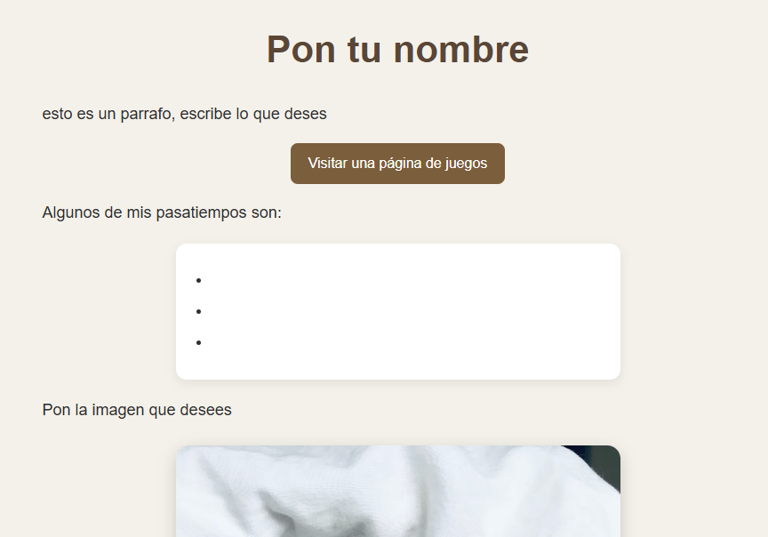
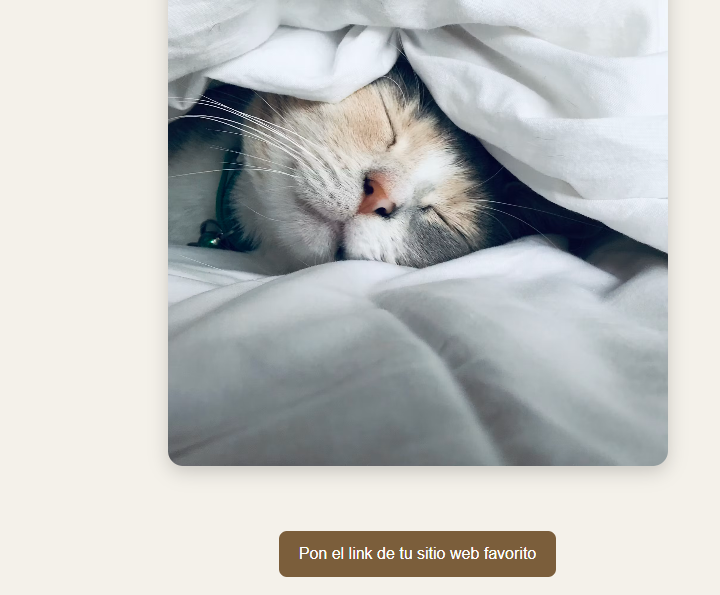

### En este formato se podra instruir a los niños de quinto que visiten nuestra especialidad, siendo guiados para poder modificar y crear una pagina web básica con html y css

### Primera version

#### el objetivo de este proyecto es que los estudiantes puedan familiarizarse con esta area de la programación y aprendan de forma interactiva donde puedan modificar los datos de la forma basica y hacer una pagina web propia